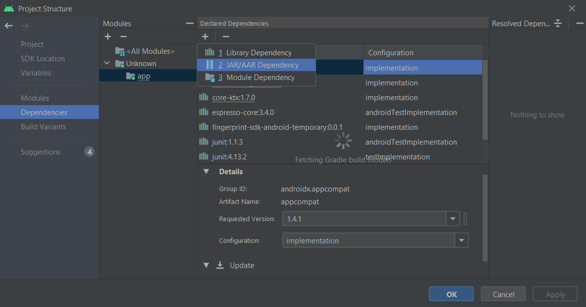
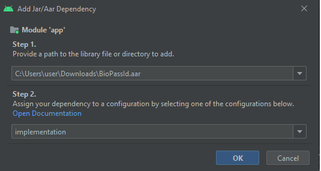

# BioPass ID Face Capture SDK Demo

# Dependencies

```gradle
dependencies {
    // Face SDK
    implementation 'com.biopassid:facesdk:0.1.21'
    implementation 'com.google.mlkit:face-detection:16.1.5'

    // Retrofit
    implementation 'com.squareup.retrofit2:retrofit:2.5.0'
    implementation 'com.squareup.retrofit2:converter-gson:2.5.0'
}
```

# Prerequisites

```
- Java 8 or higher
- Kotlin Version: 1.5.32 or higher
- Gradle Version: 7.0.2 or higher
- Android Gradle Plugin Version: 7.0.4 or higher
- A device with a camera
- License key
- BioPass ID API key
- Internet connection is required
```

Change the minimum Android sdk version to 21 (or higher) in your `app/build.gradle` file.

```gradle
minSdkVersion 21
```

Add the following in your `app/src/main/AndroidManifest.xml` file.

```xml
<manifest
    ...
    xmlns:tools="http://schemas.android.com/tools">
    ...
    <uses-permission android:name="android.permission.INTERNET"/>

   <application
        ...
        tools:replace="android:theme">
            ...
    </application>
</manifest>
```

# Installation

## With Gradle

The simplest and easiest way to install the plugin to your project, is to just add the following dependencies to your build.gradle:

```gradle
dependencies {
    implementation "com.biopassid:facesdk:tag"
}
```

Then on your settings.gradle file:

```gradle
repositories {
    // Face Capture repository on GitHub Packages
    maven {
        url = uri("https://maven.pkg.github.com/biopass-id/face-sdk-android")
        /**
         * It is recommended that credentials are stored in environment variables
         * or in local.properties
        */
        credentials {
            username = "your-username"
            password = "your-token"
        }
    }
}
```

Since we are using GitHub Packages as a tool to de publish our packages, it will need an authentication using your github account and a generated token, and store then on a local.properties file.

Here are the steps how to generate a token:

1. log in your github account
2. In the upper-right corner of any page, click your profile photo, then click Settings.
3. In the left sidebar, click Developer settings.
4. In the left sidebar, click Personal access tokens.
5. Click Generate new token.
6. Give your token a descriptive name (can be any name)
7. Click Generate token.

For more information, here you can find the [oficial Github Guide](https://docs.github.com/en/authentication/keeping-your-account-and-data-secure/creating-a-personal-access-token)

## With Local File

Another alternative to use Face Capture plugin is to download and install the AAR file locally. [Here you can find the latest releases](https://github.com/biopass-id/face-sdk-android/releases) and after downloading place the .aar file on our project folder (if you prefer you can put whetever you like).

We will use Android Studio for the following steps,

1. First, with your project open, go to **File --> Project Structure --> Dependencies**.
2. Then go to the Dependencies tab, and click on the plus symbol to show the option to add a JAR/AAR dependency.
   
3. On step 1 input the AAR file path, and select the implementation option on step 2.
   
4. Just rebuild your project and should be ready to use.

# Example

For this example we used [Enroll](https://docs.biopassid.com/#c5743ec5-c513-4f32-ab41-91854a85200c) from the Multibiometrics package.

## EnrollPersonRequest

```Kotlin
data class EnrollPersonRequest(
    @SerializedName("Person") val person: PersonRequest
)

data class PersonRequest(
    @SerializedName("CustomID") val customID: String,
    @SerializedName("Face") val face: List<FacePersonRequest>?
)

data class FacePersonRequest(
    @SerializedName("Face-1") val face: String
)
```

## EnrollPersonResponse

```Kotlin
data class EnrollPersonResponse(
    @SerializedName("Person") val person: PersonResponse?,
    @SerializedName("Message") val message: String?
)

data class PersonResponse(
    @SerializedName("ClientID") val clientID: String?,
    @SerializedName("CustomID") val customID: String?,
    @SerializedName("BioPassID") val bioPassID: String?
)
```

## BioPassIDApi

Here, you will need an [API key](https://panel.biopassid.com/pricing?menu=multibiometrics) to be able to make requests to the BioPass ID API.

```Kotlin
interface BioPassIDApi {
    @Headers("Content-Type: application/json", "Ocp-Apim-Subscription-Key: your-api-key")
    @POST("multibiometrics/enroll")
    fun enrollPerson(@Body enrollPersonRequest: EnrollPersonRequest) : Call<EnrollPersonResponse>
}
```

## Network

```Kotlin
class Network {
    companion object {

        /** Returns a Client Retrofit Instance for Requests
         */
        fun getRetrofitInstance() : BioPassIDApi {
            return Retrofit.Builder()
                .baseUrl("https://api.biopassid.com/")
                .addConverterFactory(GsonConverterFactory.create())
                .build()
                .create(BioPassIDApi::class.java)
        }
    }
}
```

## MainActivity XML

```xml
<?xml version="1.0" encoding="utf-8"?>
<androidx.constraintlayout.widget.ConstraintLayout xmlns:android="http://schemas.android.com/apk/res/android"
    xmlns:app="http://schemas.android.com/apk/res-auto"
    xmlns:tools="http://schemas.android.com/tools"
    android:layout_width="match_parent"
    android:layout_height="match_parent"
    tools:context=".MainActivity">

    <Button
        android:id="@+id/btnFaceCapture"
        android:layout_width="wrap_content"
        android:layout_height="wrap_content"
        android:layout_marginBottom="352dp"
        android:text="Face Capture"
        app:layout_constraintBottom_toBottomOf="parent"
        app:layout_constraintHorizontal_bias="0.498"
        app:layout_constraintLeft_toLeftOf="parent"
        app:layout_constraintRight_toRightOf="parent" />

</androidx.constraintlayout.widget.ConstraintLayout>
```

## MainActivity

```Kotlin
class MainActivity : AppCompatActivity() {
    private val TAG = "FaceDemo"
    private lateinit var btnFaceCapture: Button

    override fun onCreate(savedInstanceState: Bundle?) {
        super.onCreate(savedInstanceState)
        setContentView(R.layout.activity_main)

        btnFaceCapture = findViewById(R.id.btnFaceCapture)

        // Instantiate Face config by passing your license key
        val config = FaceConfigPreset.getConfig(FaceConfigType.FACE_CAPTURE)
            .setLicenseKey("your-license-key")

        // Handle Face callback
        val callback = FaceCallback { event ->
            // Encode Bitmap to base64 string
            val imageData = bitmapToBas64(event.photo)

            // Instantiate Enroll request
            val enrollPersonRequest =
                EnrollPersonRequest(
                    PersonRequest(
                        "your-customID",
                        listOf(FacePersonRequest(imageData))
                    )
                )

            // Get retrofit
            val retrofit = Network.getRetrofitInstance()

            // Execute request to the BioPass ID API
            val callback = retrofit.enrollPerson(enrollPersonRequest)

            // Handle API response
            callback.enqueue(object : Callback<EnrollPersonResponse> {
                override fun onFailure(call: Call<EnrollPersonResponse>, t: Throwable) {
                    Log.e(TAG, "Error trying to call enroll person. ${t.message}")
                }

                override fun onResponse(
                    call: Call<EnrollPersonResponse>,
                    response: Response<EnrollPersonResponse>
                ) {
                    Log.d(TAG, "EnrollPersonResponse: ${response.body()}")
                }
            })
        }

        // Build Face camera view
        btnFaceCapture.setOnClickListener {
            Face.buildCameraView(this, config, callback)
        }
    }

    private fun bitmapToBas64(bitmap: Bitmap): String {
        val stream = ByteArrayOutputStream()
        bitmap.compress(Bitmap.CompressFormat.PNG, 100, stream)
        val byteArray = stream.toByteArray()
        stream.close()
        return Base64.encodeToString(byteArray, Base64.NO_WRAP)
    }
}
```
